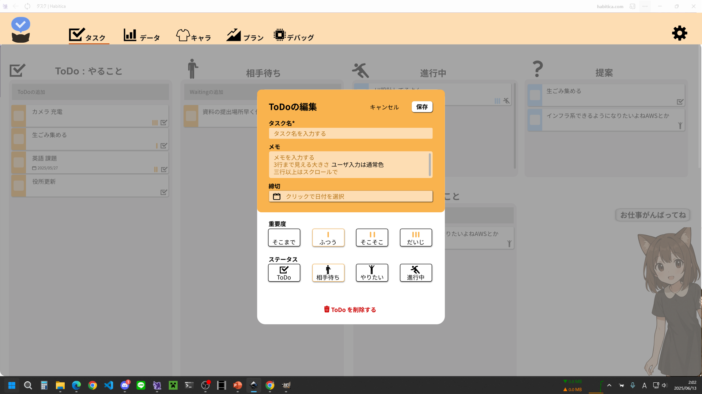
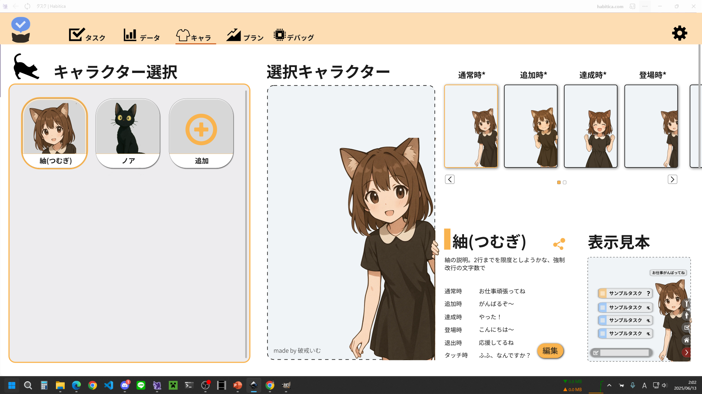
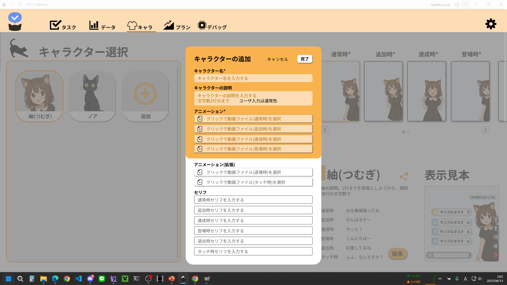
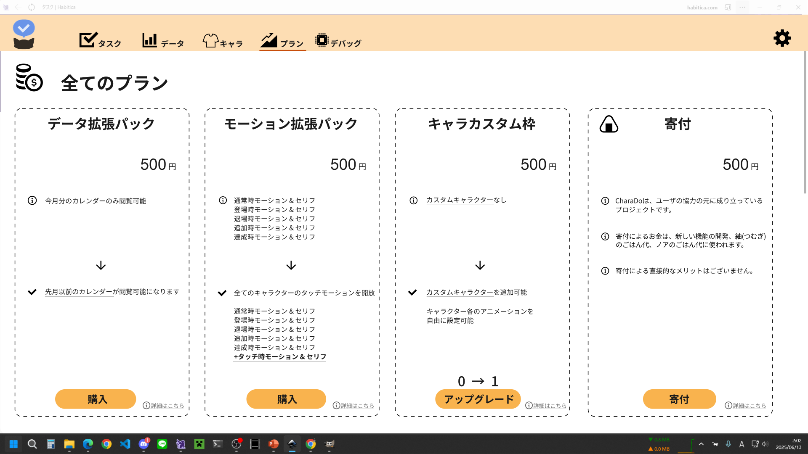
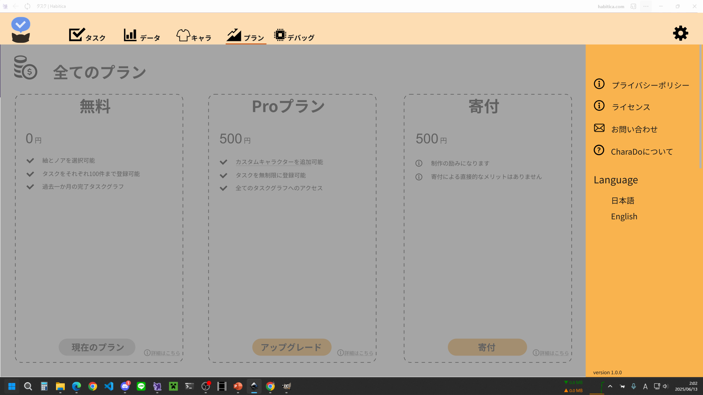
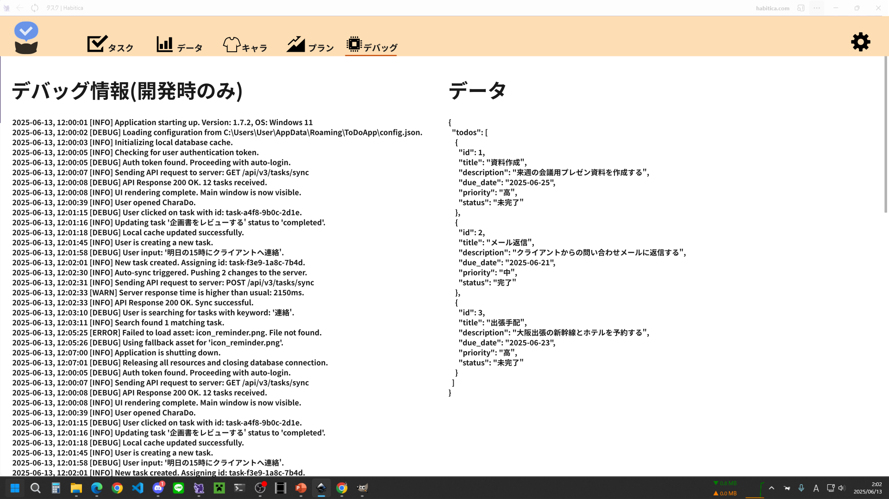
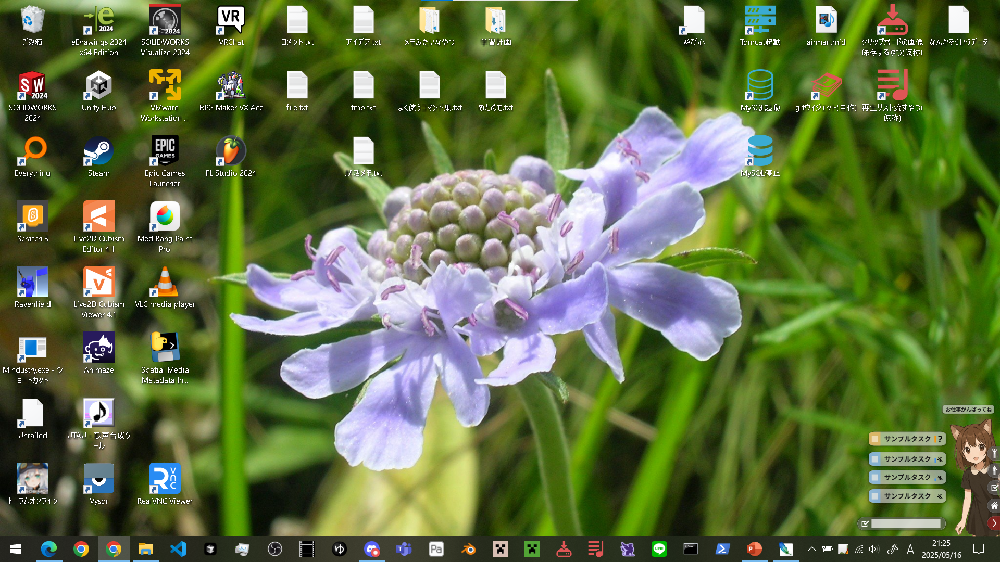

# 画面一覧
どんなものを作るか。完成品をきっちり定義するところ
主にUI

## 用語定義
- 待機タスク : ToDo・相手待ち・やりたいこと、のタスクの総称。
- ステータス : タスクの状態 ToDo・相手待ち・やりたいこと・進行中の4状態を持つ。

### コンポーネント共通
- 角丸
- ボタン
    - 基本的に影付き
    - 基本的に押せるけど今は押せない状態はグレー
    - カーソルフローで影増量
- テキスト入力箇所は、入力時は入力箇所色変更orオレンジ枠
- 基本的にカーソルフローor選択中でオレンジ枠
- フロータイルは不透明(すりガラススタイル)
- デスクトップなのでタップよりフローを気にしよう
- 処理中は上部メニューの上部のプログレスバーが動作

### その他
- アイコン
[ICOON MONO](https://icooon-mono.com/)

## id:10 [タスク画面](10_task.md)
メイン画面。タスクの追加・管理を行う。

## id:20 [タスク詳細モーダル](20_task_edit.md)
タスクの編集画面。タスクの編集・削除を行う。

## id:30 [データ画面](30_data.md)
タスクにかかわるデータの可視化を行う。

## id:40 [キャラ画面](40_character.md)
キャラクターの選択・追加を行う。

## id:50 [キャラ詳細モーダル](50_character_edit.md)
キャラクタの編集を行う。

## プラン画面
プランの選択を行う。

## 上部メニュー
画面の遷移を行う。

## 設定モーダル
そのほか設定を行う。

## デバッグ画面(製品には非表示)
開発時に必要な情報の表示に用いる。製品には非表示の機能。

## フロー画面
メイン画面。タスクの追加・管理を行う。

