# id:10 タスク画面
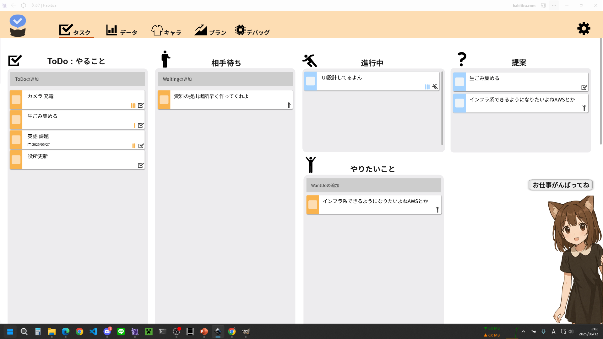

## 構成コンポーネント
- [タスクリスト](#id10-10)
    - タスク
    - タスク作成箇所

- [キャラクター](#id10-40)

### 機能 id:10
|id 	|前提状態	|操作 	|結果	|
|---	|---	|---	|---	|
|1		|	|スクロール	|画面全体がスクロールされる(ただしキャラはスクロールされない)	|

## **タスクリスト** id:10-10
タスクのリスト表示

### コンポーネント
- [タスク](#id10-20)(0-*)
- [タスク作成箇所](#id10-30)(0-1)

### 種類
ToDoリスト
相手待ちリスト
やりたいことリスト
進行中リスト : タスク作成箇所なし
提案リスト : タスク作成箇所なし ドラッグアンドドロップ対象外、ステータス変更の影響を受けない

### 全リスト共通 id:10-10
|id 	|前提状態	|操作 	|結果	|
|---	|---	|---	|---	|
|1		|タスクが削除された	|	|タスクが消え、位置が詰められる	|
|2		|タスクが編集された	|	|編集が反映され、高さに応じて位置調整される	|
|3		|タスクに変更があった	|	|リスト内のタスク位置が調整される	|

### 待機タスクリスト+進行中タスクリスト共通 id:10-10-01
|id 	|前提状態	|操作 	|結果	|
|---	|---	|---	|---	|
|1		|タスクのステータスが自リストに変更された	|	|タスクがリストの一番上に追加される	|
|2		|タスクのステータスが他リストに変更された	|	|タスクが消え、位置が詰められる	|
|3		|	|タスクを同リスト内でドラッグ&ドロップ	|タスクの順序が変更される	|
|4(4*3)		|	|タスクを別リストへドラッグ&ドロップ	|タスクのステータスが変更される	|

### 待機タスクリスト共通 id:10-10-02
|id 	|前提状態	|操作 	|結果	|
|---	|---	|---	|---	|
|1		|タスクが追加された	|	|リストと同ステータスのタスクがリストの一番上に追加される	|
|2		|タスクに変更があった	|	|リスト全体の高さが調整される	|

### ToDoリスト id:10-10-10
|id 	|前提状態	|操作 	|結果	|
|---	|---	|---	|---	|
|1		|	|	|	|

### 相手待ちリスト id:10-10-20
|id 	|前提状態	|操作 	|結果	|
|---	|---	|---	|---	|
|1		|	|	|	|

### やりたいことリスト id:10-10-30
|id 	|前提状態	|操作 	|結果	|
|---	|---	|---	|---	|
|1		|	|	|	|

### 進行中リスト id:10-10-40
スクロール可能

|id 	|前提状態	|操作 	|結果	|
|---	|---	|---	|---	|
|1		|タスクがリスト表示範囲外まである	|スクロール	|リスト内がスクロールされる	|

### 提案リスト id:10-10-40
提案リストは3件表示(タスク自体が少ないときは3件未満になることもある)

|id 	|前提状態	|操作 	|結果	|
|---	|---	|---	|---	|
|1		|提案タスクが3件未満	|	|適したタスクが下に追加される	|
|2		|提案タスクが3件未満 かつ 提案可能タスクが無い	|	|	|
|3		|提案タスクのステータスが進行中に変化	|	|タスクが消え、位置が詰められる	|

## **タスク** id:10-20
例

以下は例(ステータスが進行中になっているので間違えている、本当は青色でないといけない)
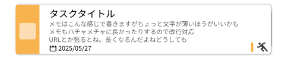
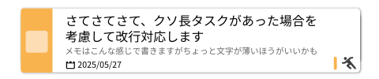

### コンポーネント
- 確定ボタン、ボディ(詳細へボタン)、ステータスボタン
- ステータスプルダウン
- タイトル、メモ、締切、重要度

### 種類
- ToDoタスク

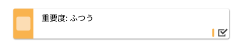

- 相手待ちタスク

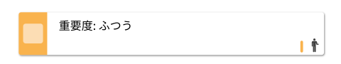

- やりたいことタスク

- 進行中タスク : 青色、決定ボタンでクリア

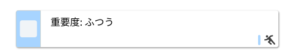

- 提案タスク : 青色

### 全タスク共通 id:10-20
|id 	|前提状態	|操作 	|結果	|
|---	|---	|---	|---	|
|1		|	|ボディーのホバー、ドラッグ&ドロップ	|オレンジ色の枠で囲われる 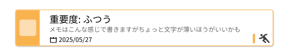	|
|2		|	|ボディをクリック	|タスク詳細モーダル表示	|
|10		|	|確定ボタンホバー	|確定ボタン明度変更 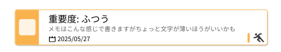	|
|20		|	|ステータスボタンホバー	|ステータスボタン影増量	|
|21		|ステータスプルダウン非表示時	|ステータスボタンがクリックされた	|ステータスプルダウン表示(現在のステータスはプルダウンに含まれない) 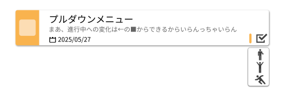	|
|22		|ステータスプルダウン表示時	|ステータスボタンがクリックされた	|ステータスプルダウン非表示	|
|23		|ステータスプルダウン表示時	|ほかの場所がクリックされた	|ステータスプルダウン非表示	|
|24(4*3)		|ステータスプルダウン表示時	|プルダウンアイテム(ステータス)がクリックされた	|ステータスが選択したステータスに変更される	|
|25		|ステータスプルダウン表示時	|ほかの場所がクリックされた	|ステータスプルダウン非表示	|
|30		|タイトルが変更された	|	|タイトルが反映され、タスク高さが調整される	|
|40		|メモが変更された	|	|メモが反映され、タスク高さが調整される	|
|50		|締切が変更された	|	|締切が反映される	|
|60		|重要度が変更された	|	|重要度が反映される     	|

### 待機タスク+提案タスク id:10-20-10
|id 	|前提状態	|操作 	|結果	|
|---	|---	|---	|---	|
|1		|	|確定ボタンクリック	|ステータスが進行中に変更される	|

### 進行中タスク id:10-20-20
|id 	|前提状態	|操作 	|結果	|
|---	|---	|---	|---	|
|1		|	|確定ボタンクリック	|タスクが達成される	|

## **タスク作成箇所** id:10-30
タイトルの入力によるタスクの作成

通常時

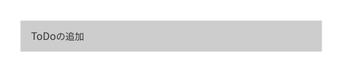

### 種類
- ToDoリスト: 初期表示 ToDoの追加
- 相手待ちリスト: 初期表示 相手待ちの追加
- やりたいことリスト: 初期表示 やりたいことの追加

### 機能 id:10-30
|id 	|前提状態	|操作 	|結果	|
|---	|---	|---	|---	|
|1		|	|ホバー	| 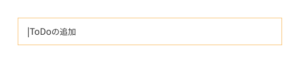	|
|2		|	|文字入力時	| 文字入力がされる。範囲外となる場合は横スクロールで対応 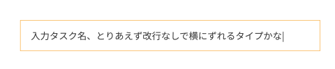	|
|3		|文字が入力されている場合	|エンターキー押下時	| タスクが追加される(タイトルは入力文字)	|

## **キャラクター** id:10-40
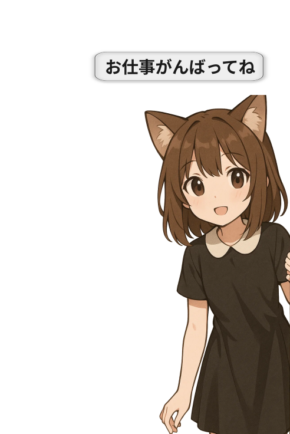

### コンポーネント
- キャラクターアニメーション
- キャラクターセリフ

キャラクターセリフは通常非表示で、アクションがあったときに一定時間フェード表示

### 機能 id:10-40
|id 	|前提状態	|操作 	|結果	|
|---	|---	|---	|---	|
|1		|一定期間アクションが無い	|	|通常時セリフを一定時間表示のち非表示	|
|2		|タスクが追加された	|	|追加時セリフを一定時間表示のち非表示	|
|3		|タスクが達成された	|	|達成時セリフを一定時間表示のち非表示	|
|4		|タスク画面が表示された	|	|登場時セリフを一定時間表示のち非表示	|
|5		|	|キャラクターをクリック	|タッチ時セリフを一定時間表示のち非表示	|
|10		|一定期間アクションが無い	|	|通常時アニメーションを一定時間再生のち通常時アニメーション再生	|
|11		|タスクが追加された	|	|追加時アニメーションを一定時間再生のち通常時アニメーション再生	|
|12		|タスクが達成された	|	|達成時アニメーションを一定時間表示のち通常時アニメーション再生	|
|13		|タスク画面が表示された	|	|登場時アニメーションを一定時間表示のち通常時アニメーション再生	|
|14		|	|キャラクターをクリック	|タッチ時アニメーションを一定時間表示のち通常時アニメーション再生	|

