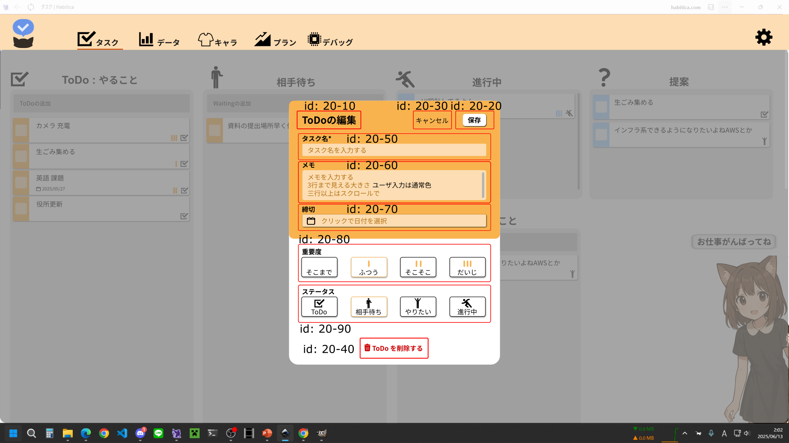
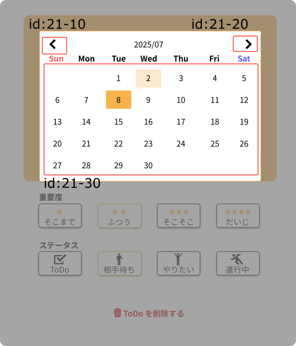
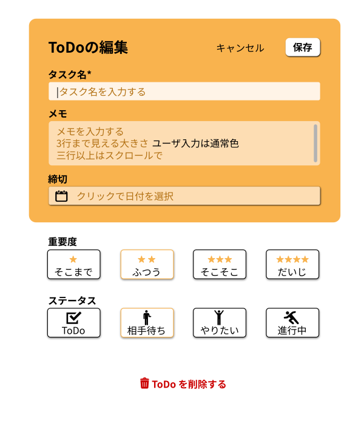

# id:20 タスク詳細モーダル

## 構成コンポーネント
- タスク詳細モーダル
	- id20-10 タイトルテキスト
	- id20-20 保存ボタン
	- id20-30 キャンセルボタン
	- id20-40 削除ボタン
	- id20-50 タスク名入力箇所
	- id20-60 メモ入力箇所
	- id20-70 締め切り選択ボタン
	- id20-80 重要度ラジオボタン
	- id20-90 ステータスラジオボタン
- 背景(タスク詳細モーダル)

- カレンダーモーダル
	- id21-10 先月ボタン
	- id21-11 来月ボタン
	- id21-30 カレンダー
- 背景(カレンダーモーダル)

### 機能 id:20
|id 	|前提状態	|操作 	|結果	|
|---	|---	|---	|---	|
|1		|	|背景(タスク詳細モーダル)がクリックされる	|変更がキャンセルされ、モーダルが閉じられる	|

## **タイトルテキスト** id:20-10

### 種類
- ToDoの編集
- 相手待ちの編集
- やりたいことの編集
- 進行中の編集

### 機能 id:20-10
|id 	|前提状態	|操作 	|結果	|
|---	|---	|---	|---	|
|1		|ToDoタスクを編集中	|	|"ToDoの編集"	|
|1		|相手待ちタスクを編集中	|	|"相手待ちの編集"	|
|1		|やりたいことを編集中	|	|"やりたいことの編集"	|
|1		|進行中タスクを編集中	|	|"進行中の編集"	|

## **保存ボタン** id:20-20
### 機能 id:20-20
|id 	|前提状態	|操作 	|結果	|
|---	|---	|---	|---	|
|1		|タスク名入力箇所に入力がある	|ホバー	|影増量	|
|2		|タスク名入力箇所に入力がある	|クリック	|変更が反映され、モーダルが閉じられる	|
|3		|タスク名入力箇所に入力がない	|	|灰色(動作不可能状態)	|

## **キャンセルボタン** id:20-30
### 機能 id:20-30
|id 	|前提状態	|操作 	|結果	|
|---	|---	|---	|---	|
|1		|	|ホバー	|アンダーライン	|
|2		|	|クリック	|変更がキャンセルされ、モーダルが閉じられる	|

## **削除ボタン** id:20-40
### 機能 id:20-40
|id 	|前提状態	|操作 	|結果	|
|---	|---	|---	|---	|
|1		|	|ホバー	|影増量	|
|2		|	|クリック	|タスクが削除され、モーダルが閉じられる	|

## **タスク名入力箇所** id:20-50
### 機能 id:20-50
|id 	|前提状態	|操作 	|結果	|
|---	|---	|---	|---	|
|1		|何も入力されていない	|	|"タスク名を入力する"	|
|2		|	|ホバー	| 明度変更 	|
|3		|	|文字入力	|文字入力される。文字量が多い場合は横スクロール	|

## **メモ入力箇所** id:20-60
### 機能 id:20-60
|id 	|前提状態	|操作 	|結果	|
|---	|---	|---	|---	|
|1		|何も入力されていない	|	|"メモを入力する"	|
|2		|	|ホバー	| 明度変更	|
|3		|	|文字入力	|文字入力される。文字量が多い場合は縦スクロール(改行可能)	|

## **締め切り選択ボタン** id:20-70
### 機能 id:20-70
|id 	|前提状態	|操作 	|結果	|
|---	|---	|---	|---	|
|1		|締め切りが未選択	|	|"クリックして日付を選択"	|
|2		|	|ホバー	| 影増量	|
|3		|	|クリック	|カレンダーモーダル表示	|
|4		|締め切りが設定された	|	|設定した締め切りが表示される	|

## **重要度ラジオボタン** id:20-80
初期値: ふつう
### 機能 id:20-80
|id 	|前提状態	|操作 	|結果	|
|---	|---	|---	|---	|
|1		|選択中の重要度	|	|オレンジ枠	|
|2		|	|ホバー	|影増量	|
|3		|	|クリック	|クリックした重要度が選択中になる	|

## **ステータスラジオボタン** id:20-90
初期値: 編集中ステータス
### 機能 id:20-90
|id 	|前提状態	|操作 	|結果	|
|---	|---	|---	|---	|
|1		|選択中のステータス	|	|オレンジ枠	|
|2		|	|ホバー	|影増量	|
|3		|	|クリック	|クリックしたステータスが選択中になる	|

## **カレンダーモーダル** id:21
ふつうにカレンダー

### 機能 id:20
|id 	|前提状態	|操作 	|結果	|
|---	|---	|---	|---	|
|1		|	|背景(カレンダーモーダル)がクリックされる	|カレンダーモーダルが閉じられる	|

## **先月ボタン** id:21-10
### 機能 id:21-10
|id 	|前提状態	|操作 	|結果	|
|---	|---	|---	|---	|
|1		|	|クリック	|カレンダーが先月に、表示月も変更される	|

## **先月ボタン** id:21-11
### 機能 id:20-11
|id 	|前提状態	|操作 	|結果	|
|---	|---	|---	|---	|
|1		|	|クリック	|カレンダーが来月に、表示月も変更される	|

## **カレンダー** id:21-30
### コンポーネント
- 日付ボタン

### 機能 id:20-30
|id 	|前提状態	|操作 	|結果	|
|---	|---	|---	|---	|
|1		|既選択日がある	|	|既選択日の日付ボタンは薄オレンジ	|
|2		|	|ホバー	|ホバーされた日付ボタンはオレンジ	|
|2		|	|クリック	|クリックされた日付が選択され、カレンダーモーダルが閉じられる	|

