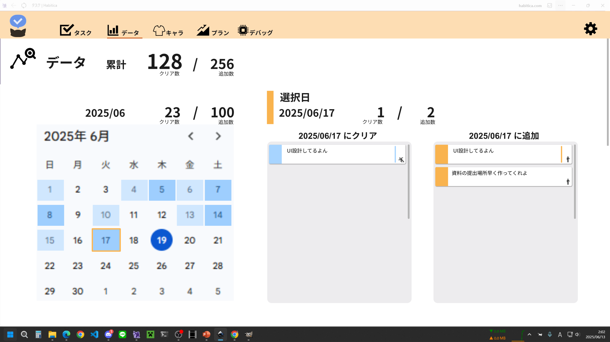

# id:30 データ画面

## **構成コンポーネント**
- カレンダー
  - id31-10 先月ボタン
  - id31-20 来月ボタン
  - id31-30 カレンダー
- タスクリスト
  - クリアタスク
  - 追加タスク
- 数値表示スペース
  - クリアタスク数
  - 追加タスク数
 
## **先月ボタン**　id:31-10
### 機能　id:31-10
|id|前提条件|操作|結果|
|------|------|-------|------|
|1||ホバー|影増量|
|1||クリック|カレンダーが先月に、表示月も変更される|

## **来月ボタン**　id:31-20
## 機能:id31-20
|id|前提条件|操作|結果|
|------|------|-------|------|
|1||ホバー|影増量|
|1||クリック|カレンダーが先月に、表示月も変更される|

## **カレンダー** id:31-30
- 横7日×縦5週分で表示する
- 週初めは日曜にする
- 曜日の表示は英語3文字（SUN,MON,TUE等）
- 曜日のフォントカラーは基本黒。土日だけ青赤にする。
### コンポーネント
- 日付ボタン
### 機能 id:31-30

|id|前提条件|操作|結果|
|------|------|-------|------|
||既選択日がある||既選択日はオレンジで円状に塗りつぶしで囲む|
|||カレンダー内にアプリを開いている日付がある|該当する日付は濃い青で円状に塗りつぶしで囲む。日付のフォントは白に変更される|
||||完了タスク数に応じて日付を4段階で青色で色分けする|
|||ホバー|ホバーされた日付ボタンは薄い黒で影増量|
|||クリック|クリックされた日付が選択され、クリアタスクリストと追加タスクリストに反映される|
|||先月の日付がクリックされた|カレンダーが先月に、表示月も変更される|
|||来月の日付がクリックされた|カレンダーが来月に、表示月も変更される|

- id31-30-02のタスク数基準は絶対or相対？