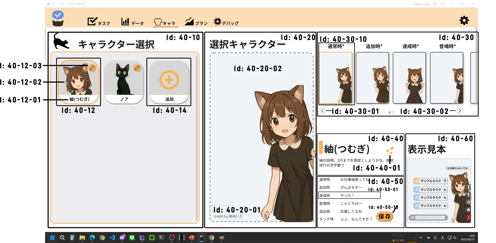

# id:40 キャラ画面

## 構成コンポーネント
- id40-10 キャラクター選択箇所
- id40-20 選択キャラクター表示箇所
- id40-30 アニメーション選択箇所
- id40-40 基本情報表示箇所
- id40-50 セリフ編集箇所
- id40-60 見本表示箇所

## id40-10 キャラクター選択箇所
タスクのリスト表示

### コンポーネント
- id40-12 キャラクター選択ボタン
- id40-14 キャラクター追加ボタン

### 機能
|id 	|前提状態	|操作 	|結果	|
|---	|---	|---	|---	|
|1		|キャラクターが削除された	|	|当該キャラクター選択ボタンが消える	|
|2		|キャラクターが追加された	|	|当該キャラクター選択ボタンが末尾に追加される	|
|3		|	|	|キャラクター選択ボタンらの末尾に常にキャラクター追加ボタンがある	|

## id40-12 キャラクター選択ボタン
キャラクターを選択するボタン(編集ボタン付き)

### 種類
- アプリ標準キャラクター
	編集ボタン無し(名前、説明、アニメーション編集不可能)
	autherに文字列が存在
- ユーザ作成キャラクター
	編集ボタンあり(編集可能)
	autherは空文字

### コンポーネント
- id40-12-01 キャラクター名
- id40-12-02 キャラクター画像
- id40-12-03 キャラクター編集ボタン

### 機能
|id 	|前提状態	|操作 	|結果	|
|---	|---	|---	|---	|
|1		|編集ボタンが存在する	|編集ボタン押下	|当該キャラクターのキャラ詳細モーダル表示	|
|2		|	|キャラクター選択ボタン押下	|当該キャラクターが選択される	|
|3		|キャラクターが選択されている	|	|枠がオレンジ色である	|
|4		|キャラクターが編集された	|	|キャラクター名・キャラクター画像を更新する	|

## id40-14 キャラクター追加ボタン
キャラクター追加ボタン(キャラカスタム枠を購入していないと利用不可)

### 機能
|id 	|前提状態	|操作 	|結果	|
|---	|---	|---	|---	|
|1		|キャラカスタム枠未購入	|追加ボタン押下	|プラン画面へ遷移("キャラカスタム枠のご購入が必要です")	|
|2		|キャラカスタム枠購入済 ∧ 購入分カスタム枠使用済	|追加ボタン押下	|プラン画面へ遷移("キャラカスタム枠の追加が必要です")	|
|3		|キャラカスタム枠購入済 ∧ 購入分カスタム枠残数あり	|追加ボタン押下	|新規キャラのキャラ詳細モーダル表示	|

## id40-20 選択キャラクター表示箇所
選択したキャラクターの表示場所

### コンポーネント
- id40-20-01 auther
- id40-20-02 選択キャラクター表示

### 機能
|id 	|前提状態	|操作 	|結果	|
|---	|---	|---	|---	|
|1		|選択キャラクターがアプリ標準キャラクターである	|	|auther表記(mmade by <auther>)が存在する	|
|2		|選択キャラクターがユーザ作成キャラクターである	|	|auther表記(mmade by <auther>)が存在しない	|
|3		|	|キャラクターが選択された	|選択キャラクター表示が、当該キャラクター登場時アニメーションが表示される => 通常時アニメーションが表示される	|

## id40-30 アニメーション選択箇所
選択したキャラクターのアニメーション確認のための、アニメーション選択画面
1ページ目: 必須アニメーション
2ページ目: 追加アニメーション

### コンポーネント
- id40-30-01 前へボタン
- id40-30-02 次へボタン
- id40-30-10 アニメーション選択ボタン

### 機能
|id 	|前提状態	|操作 	|結果	|
|---	|---	|---	|---	|
|1		|アニメーションが1ページ目である	|前へボタン押下	|効果しない(灰色表記)	|
|2		|アニメーションが1ページ目である	|次へボタン押下	|2ページ目へ遷移	|
|3		|アニメーションが2ページ目である	|前へボタン押下	|1ページ目へ遷移	|
|4		|アニメーションが2ページ目である	|次へボタン押下	|効果しない(灰色表記)	|
|5		|アニメーションが選択(表示・再生)されている	|	|該当アニメーションボタンの枠がオレンジ色である	|
|6		|	|アニメーションボタン押下	|当該アニメーションが選択キャラクター表示で表示・再生される	|
|7		|(通常時以外)アニメーションが再生終了	|	|通常時アニメーションが選択状態となり、該当アニメーションが選択キャラクター表示で表示・再生される	|
|8		|モーション拡張パック未購入	|タッチ時アニメーションボタン押下	|プラン画面へ遷移("モーション拡張パックのご購入が必要です")	|

## id40-40 基本情報表示箇所
選択したキャラクターの基本情報表示箇所
名前へ説明が表示される

### コンポーネント
- id40-40-01: キャラクター共有ボタン

### 機能
|id 	|前提状態	|操作 	|結果	|
|---	|---	|---	|---	|
|1		|選択キャラクターがユーザ作成キャラクターである	|キャラクター共有ボタン押下	|キャラクター設定エクスポート	|

## id40-50 セリフ編集箇所
各キャラクターのセリフ編集を行う

### コンポーネント
- id40-50-01: セリフ入力箇所
- id40-50-10: セリフ保存ボタン

### 機能
|id 	|前提状態	|操作 	|結果	|
|---	|---	|---	|---	|
|1		|モーション拡張パック未購入	|セリフ保存ボタン押下	|プラン画面へ遷移("モーション拡張パックのご購入が必要です")	|
|2		|モーション拡張パック購入済	|セリフ保存ボタン押下	|セリフ入力箇所のセリフを保存	|

## id40-60 見本表示箇所
アニメーション選択箇所と同様の機能
実際の表示と同じサイズ・同じ状態での表示を確認できる