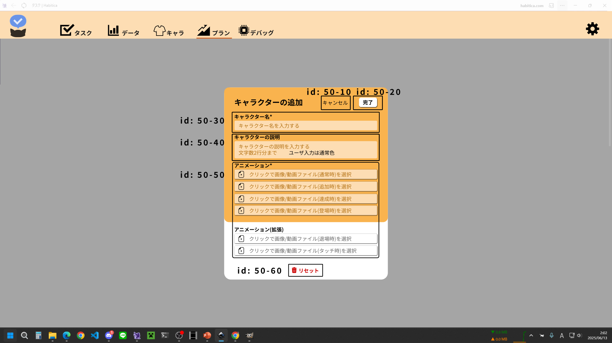

# id:50 キャラ詳細モーダル

## 構成コンポーネント
- id50-10 キャンセルボタン
- id50-20 保存ボタン
- id50-30 キャラクター名入力箇所
- id50-40 キャラクター説明入力箇所
- id50-50 アニメーション入力箇所
- id50-60 リセットボタン

## id50-10 キャンセルボタン
### 機能
|id 	|前提状態	|操作 	|結果	|
|---	|---	|---	|---	|
|1		|	|キャンセルボタン押下	|キャラ詳細モーダルが閉じられる	|

## id50-20 保存ボタン
### 機能
|id 	|前提状態	|操作 	|結果	|
|---	|---	|---	|---	|
|1		|キャラクター名入力箇所に入力がある ∧ 必須アニメーションが選択済	|保存ボタン押下	|変更が保存され、キャラ詳細モーダルが閉じられる	|
|2		|キャラクター名入力箇所に入力がない ∨ 必須アニメーションが未選択	|	|灰色(動作不可能状態)	|

## id50-30 キャラクター名入力箇所
### 機能
|id 	|前提状態	|操作 	|結果	|
|---	|---	|---	|---	|
|1		|何も入力されていない	|	|"キャラクターの説明を入力する"	|
|2		|	|文字入力	|文字入力される。文字量が多い場合は横スクロール	|
|3		|	|入力文字0文字で確定	|"キャラクター名は必須です"	|

## id50-40 キャラクター説明入力箇所
### 機能
|id 	|前提状態	|操作 	|結果	|
|---	|---	|---	|---	|
|1		|何も入力されていない	|	|"キャラクター名を入力する"	|
|2		|	|	|文字数制限アリ	|

## id50-50 アニメーション入力箇所
### 種類
- 必須アニメーション
	選択しないと保存不可能
- 追加アニメーション
	選択しなくても保存可能

### 機能
|id 	|前提状態	|操作 	|結果	|
|---	|---	|---	|---	|
|1		|	|アニメーション入力箇所押下	|ファイル選択へ(画像orアニメーションを選択)	|

## id50-60 キャンセルボタン
### 機能
|id 	|前提状態	|操作 	|結果	|
|---	|---	|---	|---	|
|1		|	|キャンセルボタン押下	|全ての入力項目をクリア	|