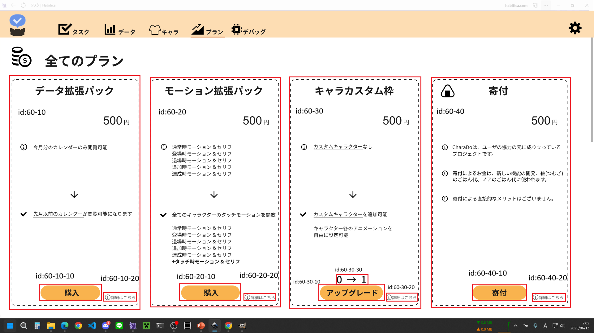

# id:60 プラン画面

## 構成コンポーネント
- データ拡張パック #id60-10
    - ボタン #id60-10-10
    - 詳細 #id60-10-20
- モーション拡張パック #id60-20
    - ボタン #id60-20-10
    - 詳細 #id60-20-20
- キャラカスタム枠 #id60-30
    - ボタン #id60-30-10
    - 詳細 #id60-30-20
    - 枠数 #id60-30-30
- 寄付 #id60-40
    - ボタン #id60-40-10
    - 詳細 #id60-40-20

※決済画面への遷移  
ストアページにリダイレクト(Steamoverlay) or 購入アイテムを指定して直接決済画面を表示する(Steam Microtransaction API)  

## 基本機能 id:60
|id 	|前提状態	|操作 	|結果	|
|---	|---	|---	|---	|

## データ拡張パック: id:60-10
### ボタン: id:60-10-10
|id 	|前提状態	|操作 	|結果	|
|---	|---	|---	|---	|
|1		|データ拡張パック未購入	|ホバー	|影増量	|
|2		|データ拡張パック未購入	|クリック	|Steam決済画面へ遷移(データ拡張)|
|3		|データ拡張パック未購入	|表示	|ボタンテキスト="購入" , ボタン色="黄色"	|
|4		|データ拡張パック購入済	|表示	|ボタンテキスト="購入済み" , ボタン色="灰色"	|
### 詳細: id:60-10-20
|id 	|前提状態	|操作 	|結果	|
|---	|---	|---	|---	|
|1		|常時	|クリック	|詳細ページへ遷移	|

## モーション拡張パック: id:60-20
### ボタン: id:60-20-10
|id 	|前提状態	|操作 	|結果	|
|---	|---	|---	|---	|
|1		|モーション拡張パック未購入	|ホバー	|影増量	|
|2		|モーション拡張パック未購入	|クリック	|Steam決済画面へ遷移(モーション拡張)	|
|3		|モーション拡張パック未購入	|表示	|ボタンテキスト="購入" , ボタン色="黄色"	|
|4		|モーション拡張パック購入済	|表示	|ボタンテキスト="購入済み" , ボタン色="灰色"	|
### 詳細: id:60-20-20
|id 	|前提状態	|操作 	|結果	|
|---	|---	|---	|---	|
|1		|常時	|クリック	|詳細ページへ遷移	|

## キャラカスタム枠: id:60-30
### ボタン: id:60-30-10
|id 	|前提状態	|操作 	|結果	|
|---	|---	|---	|---	|
|1		|キャラカスタム枠保持数が一定以下(<=n)	|ホバー	|影増量	|
|2		|キャラカスタム枠保持数が一定以下(<=n)	|クリック	|Steam決済画面へ遷移(キャラカスタム枠購入)	|
|3		|キャラカスタム枠保持数が一定以下(<=n)	|表示	|ボタンテキスト="アップグレード" , ボタン色="黄色"	|
|4		|キャラカスタム枠保持数が一定を超える(>n)	|表示	|ボタンテキスト="アップグレード不可" , ボタン色="灰色"	|
### 詳細: id:60-30-20
|id 	|前提状態	|操作 	|結果	|
|---	|---	|---	|---	|
|1		|常時	|クリック	|詳細ページへ遷移	|
### 枠数: id:60-30-30
|id 	|前提状態	|操作 	|結果	|
|---	|---	|---	|---	|
|1		|常時	|表示	|枠保持数→枠保持数+1	|

## 寄付: id:60-40
### ボタン: id:60-40-10
|id 	|前提状態	|操作 	|結果	|
|---	|---	|---	|---	|
|1		|常時	|ホバー	|影増量	|
|2		|常時   |クリック	|Steam決済画面へ遷移(寄付) |
|3		|常時	|表示	|ボタンテキスト="寄付" , ボタン色="黄色" |
### 詳細: id:60-40-20
|id 	|前提状態	|操作 	|結果	|
|---	|---	|---	|---	|
|1		|常時	|クリック	|詳細ページへ遷移	|

ここから下はモーダルを分けることになれば別のファイルに移動します(別画面に遷移して実装してもいいかも)

## id:XX プラン購入モーダル
ここに画像を挿入

## 構成コンポーネント
- idXX-10 タイトルテキスト
- idXX-20 キャンセルボタン
- idXX-30 プラン名テキスト
- idXX-40 支払金額テキスト
- idXX-50 支払ボタン

## 基本機能 id:XX
|id 	|前提状態	|操作 	|結果	|
|---	|---	|---	|---	|
|1		|	|プラン変更モーダル外がクリックされる	|変更がキャンセルされ、モーダルが閉じられる	|

## タイトルテキスト id:XX-10
|id 	|前提状態	|操作 	|結果	|
|---	|---	|---	|---	|
|1		|データ拡張          |表示 |データ拡張パックのご購入 |
|2		|モーション拡張       |表示 |モーション拡張パックのご購入 |
|3		|キャラカスタム枠購入 |表示	|キャラカスタム枠のご購入 |
|4		|寄付	             |表示 |寄付 |

## キャンセルボタン id:XX-20
|id 	|前提状態	|操作 	|結果	|
|---	|---	|---	|---	|
|1		|常時	|ホバー	|アンダーライン	|
|2		|常時	|クリック	|変更がキャンセルされ、モーダルが閉じられる	|

## プラン名テキスト id:XX-30
|id 	|前提状態	|操作 	|結果	|
|---	|---	|---	|---	|
|1      |データ拡張          |表示 |データ拡張 |
|2      |モーション拡張      |表示 |モーション拡張   |
|3      |キャラカスタム枠購入 |表示 |キャラカスタム枠購入 |
|4      |寄付               |表示 |寄付 |

## 支払金額テキスト id:XX-40
|id 	|前提状態	|操作 	|結果	|
|---	|---	|---	|---	|
|1      |データ拡張	         |表示 |¥500 |
|2      |モーション拡張      |表示 |¥500 |
|3      |キャラカスタム枠購入 |表示 |¥500 |
|4      |寄付               |表示 |¥500 |

## 支払ボタン id:XX-50
|id 	|前提状態	|操作 	|結果	|
|---	|---	|---	|---	|
|1		|常時	|ホバー	|アンダーライン	|
|2		|常時	|クリック	|Steam決済画面へ遷移 |